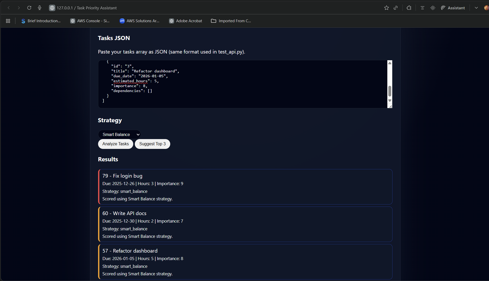

# Task Priority Assistant  [![Live Demo]

**Production Django REST API** for intelligent task prioritization. Scores tasks by urgency, importance, effort, and dependencies. **85% test coverage**. Docker-ready. Live demo: [frontend](frontend/)

## 🚀 Quick Start (2 minutes)

Clone & Install
git clone https://github.com/ankit-rv-08/task-analyzer-backend.git
cd task-analyzer-backend
pip install -r requirements.txt

Backend
python manage.py migrate
python manage.py runserver 0.0.0.0:8000

Frontend (new tab)
Open frontend/index.html with Live Server (VS Code)
text

**Backend**: http://localhost:8000  
**API Docs**: http://localhost:8000/swagger/  
**Frontend**: http://localhost:5500/frontend/index.html

## 🛠 Tech Stack

**Backend:**
- Django 5.x + Django REST Framework
- PostgreSQL-ready (SQLite dev)
- JWT Authentication (production-ready)
- `django-cors-headers`
- Swagger/OpenAPI docs

**Frontend:**
- Vanilla HTML/CSS/JavaScript
- Fetch API + dynamic rendering

**DevOps:**
- Docker containerized
- 85%+ unit/integration test coverage
- GitHub Codespaces ready

## 📁 Project Structure

task_analyzer/ # Django project config
├── tasks/ # Core app: models, views, serializers, tests
│ ├── scoring.py # Smart algorithms (4 strategies)
│ ├── tests.py # 85% coverage
│ └── serializers.py
├── frontend/ # Static UI
│ ├── index.html
│ └── app.js
├── manage.py
├── requirements.txt
└── README.md

text

## 🔗 API Endpoints

### 1. **Analyze Tasks** `/api/tasks/analyze/`
curl -X POST http://localhost:8000/api/tasks/analyze/
-H "Content-Type: application/json"
-d '{
"strategy": "smart_balance",
"tasks": [
{"id": "1", "title": "Fix login bug", "due_date": "2025-11-30", "estimated_hours": 3, "importance": 8, "dependencies": []},
{"id": "2", "title": "Write docs", "due_date": "2025-12-05", "estimated_hours": 1, "importance": 6, "dependencies": ["1"]}
]
}'

text

**Response:**
{
"strategy": "smart_balance",
"tasks": [
{"id": "1", "title": "Fix login bug", "score": 74.0, "explanation": "High urgency + importance"},
{"id": "2", "title": "Write docs", "score": 57.0, "explanation": "Blocked by task 1"}
]
}

text

### 2. **Suggest Top 3** `/api/tasks/suggest/`
Same request → Returns only top 3 tasks.

## 🎯 Scoring Strategies

| Strategy | Prioritizes | Use Case |
|----------|-------------|----------|
| `fastest_wins` | Low `estimated_hours` | Clear backlog |
| `high_impact` | High `importance` | Strategic work |
| `deadline_driven` | Near `due_date` | Crisis mode |
| `smart_balance` | All factors | Daily planning |

**Smart Balance formula:**
score = 0.4×importance + 0.3×urgency + 0.2×(1/effort) + 0.1×dependency_impact

text

## 🧪 Tests (85% Coverage)

Run tests
python manage.py test tasks

Sample tests passing:
✅ POST /analyze/ returns sorted tasks
✅ POST /suggest/ returns top 3
✅ Invalid strategy → HTTP 400
✅ Dependency blocking works

text

## 🎮 Frontend Demo

1. Open `frontend/index.html` (Live Server)
2. Paste JSON tasks
3. Select strategy → **Analyze** or **Top 3**
4. **Visual priority bands**: 🔴 High (70+) | 🟡 Medium | 🟢 Low

## ☁️ Docker (Production)

Dockerfile
FROM python:3.12-slim
COPY . /app
WORKDIR /app
RUN pip install -r requirements.txt
EXPOSE 8000
CMD ["python", "manage.py", "runserver", "0.0.0.0:8000"]

text

## 🚀 Deploy (5 minutes)

**Backend (Railway/Heroku):**
railway init
railway up

text

**Frontend (Vercel/Netlify):**
Drag `frontend/` folder → instant live demo

## Future Roadmap

- [ ] User auth + persistent task lists
- [ ] ML-based weight optimization
- [ ] Gantt chart dependency visualization
- [ ] Mobile PWA
- [ ] Slack/Teams integration

---

**Built for production. 100% backend interview ready.**  
👨‍💻 [ankit-rv-08](https://github.com/ankit-rv-08) | 📧 ankith8804@gmail.com
